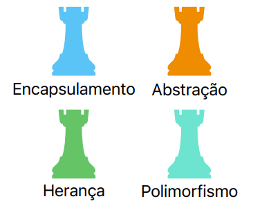
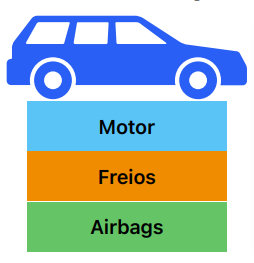
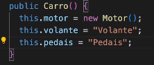

# Princípios de POO

# Pilares de POO


Seguindo esses quatro pilares, será possivel obter um projeto orientado à objetos.
<hr>

## Encapsulamento

Seu objetivo é esconder detalhes internos, expondo a interface facilitada do objeto. Por exemplo:


Imagine um carro. O motorista que é usuário do carro, ele pode interagir com o carro.

Mas ele interage somente com as interfaces disponíveis no carro (volante, pedais, o painel). Então,
ele não precisa necessariamente saber como é o funcionamento do motor, dos airbags.. isso são detalhes
ocultos, ou... **encapsulados**.

Não é bacana, portanto, deixamos todos os objetos da nossa clase exposto. É possível que ao fazer isso,
o cliente não saiba/consiga usar o produto da forma correta (e até mesmo, segura).

O AirBag, por exemplo, não deve ser ativado pelo usuário quando bem quiser... e ainda entra os
modificadores de acesso.
<hr>

## Modificadores de Acesso - Atributos

Quais atributos fazem sentido ser publicos ou privados?

Foi o que falamos acima, volante e pedal é ok ser publico e acessado quando bem entender.
Já o airbag e motor, não...

Para os visíveis (publicos), utilizamos: ```public String volante```.

Para os privados (private), utilizamos: ```private String airbag```.

O private fará ser possível acessar os atributos somente dentro da própria classe.

## Modificadores de Acesso - Métodos

Também podemos usar esses modificadores nos métodos.

Em suma, se quiser esconder um método é só declarar o modificador private!
<hr>

## Getters e Setters

Dificilmente teremos atributos públicos. A maioria sempre será private e acessaremos os mesmos com
Getters e Setters.

Eles nos permitem buscar o atributo em questão (get) e settar algum valor neles (setter).
<hr>

## Modificadores de Acesso - Classes

As classes também podem ser modificadas. Porém só possuem 2 modificadores.

O public que é o padrão.

Mas também tem o “default”. Ou seja, vai ficar só ```class Carro {}```.
<hr>

## Encapsulamento no Construtor

O Construtor até pode ser private, o problema é que não será possivel instanciá-lo em outras classes.

Vale lembrar que o Construtor é onde inicializamos os atributos. Então é o local onde colocaremos os
valores que desejarmos.


<hr>

## Abstração

Basicamente, seria esconder/exibir dados e comportamentos.

Isso é importante, pois é comum a gente esconder detalhes dos objetos, para facilitar seu uso. Uma TV,
por exemplo, é muito complexa, quase ninguem sabe construir uma TV. Mas ela é entregue pra você com
uma interface simples de uso.

Para fazermos isso, basta criarmos métodos de utilização pro produto.
No caso da TV, seria criar métodos de aumentarVolume, diminuirVolume, trocarCanal... 

Ah, nesses métodos a gente sempre trabalha com o atributo, a gente vai usar o "this", para EVIDENCIAR
que é o atributo da classe! Exemplo:
```java
public void trocarCanal(int novoCanal) {
    this.canal = novoCanal;
    // usando o this para referenciar ao atributo da classe, e trocando seu valor para o que
    // está no parâmetro.
}
```
<hr>

## Herança

Seria o reuso. A ideia é evirtarmos desperdício. 

Ou seja, vamos centralizar a lógica em um lugar e torná-la acessível.


Nós teremos uma classe pai (chamada de super classe), e ela irá possuir atributos e métodos a serem herdados por 
outras classes (classes filhas).

Vamos imaginar um exemplo de super-heróis. Em um pacote podemos ter uma classe: HomemAranha, Tempestade e HomemDeFerro.

Não é correto dentro do Main nós criarmos diversos métodos passando um super-heroi para cada um.

O correto, portanto, seria criar uma super classe denominada SuperHerói, contendo nela tudo o que um super-herói 
irá fazer.

Atributos padronizados, um método e até mesmo um construtor para iniciar um novo super-herói.

### Beleza, a super classe foi criada. E pra aplicar ela a outras classes filha?

A gente simplesmente vai até a classe filha, HomemDeFerro, por exemplo, e usa a palavra **extends**.

Essa classe filha agora irá herdar e ser uma subclasse da outra. Vai herdar todos os atributos, métodos e construtores
da superclasse.
<hr>

## Palavra Super

Na classe filha, nós vamos criar um construtor (com a mesma quantidade de parametros) igual a superclasse.

Esse construtor vai ter um "super()" com os parametros ali dentro. Isso serve pra referenciar a superclasse
(ao construtor dela).
<hr>

## Sobrescrever Métodos

Se quisermos sobrescrever algo, basta reescrever o metodo na classe que desejamos! 
<hr>

## Modificador Protected - Atributos

Com os atributos private, não é possivel acessá-los nas classes filhas. Para que isso seja possível, utilizamos:
protected.
<hr>

## Modificador Protected - Métodos

Se utilizarmos o protected nos métodos da classe pai, somente quem está no pacote ou é subclasse, poderá usar.
Na Main por exemplo, não será possível.
<hr>

## InstanceOf

Imagine um cenário, onde a gente precise pegar esse Array de super herói e chamar algum método que irá ver se o
super herói é suportado pelo jogo.

Criamos um método que retornará um void e passaremos como parametro um Array de SuperHeroi. Mas para validarmos
esse parametro, conhecer seu tipo. Se é um HomemAranha ou HomemDeFerro, saber o seu tipo concreto.

Para descobrirmos o tipo concreto de uma super classe, usaremos InstanceOf.
```java
static void validar(SuperHeroi[] superHerois) {
    //Verifica se o objeto super-heroi na posição 0 é uma instância do objeto HomemAranha
    if (superHerois[0] instanceof HomemAranha) {
        System.out.println("Lógica de validação do Homem Aranha");
    }
}
```
<hr>

## A Classe Object

Tudo no java é Object, tudo mesmo, até mesmo classes. Todas elas herdam métodos, atributos e comportamentos
do Object do java.

## Classes Abstratas

Sem a classe SuperHeroi ser abstrata, nós poderiamos ir no Main e criar simplesmente um:
```java
new SuperHeroi("meu traje", new String[] {"contar piada"});
```

Ou seja, uma instância de SuperHeroi sem definir um nome específico, nem nada do tipo. A partir do momento que 
definimos a classe pai como ‘Abstract’, não é mais possível criar uma instância da classe pai sem definir um nome
a ela.

**Bom, mas os métodos dessa classe também podem ser abstratos.**

E isso significa que esse método ficará vazio! Sem corpo, sem definição, sem nenhum bloco de comando.
Somente com o seu retorno e parâmetro, assim:
```java
public abstract void usarSuperPoder(int index);
```

**E o resultado disso?**

Bom, o que acontece, é que as classes, com esse método que se tornou abstrato implementado, vai precisar
que a gente (de forma obrigatória), defina o seu corpo e os seus blocos de comando (o que de fato ele irá fazer).

Usaremos o @Override e implementaremos o que a gente quer.
<hr>

## Interface

Uma classe abstrata pode ter atributos/metodos protected, atributos/métodos abstract.

Mas uma classe com Interface, é diferente! A gente só pode ter **definição de métodos.** Ela não terá atributos, nem
definições de corpo de método.

Por exemplo, uma interface Avenger. O que a gente espera que uma classe que terá essa interface tenha?

Por fim, nos iremos à classe e implementaremos essa interface.

```java
public class HomemAranha extends SuperHeroi implements Avenger{}
```

Não existe herança multipla (multiplos extends), mas podemos implementar diversas interfaces.

Cabe destacar, que ao implementar uma interface a classe que deverá cumprir um "contrato". Ou seja, deverá implementar
os métodos (que por padrão sao abstratos).

## Método Default (Interface)

A interface também pode ter um método chamado default. Todos as classes que terão essa interface implementarão ele.

Mas... não é o ideal usar isso. Quando a gente usa muito método default acaba que a gente transforma a interface numa
classe e isso não é bacana.
<hr>

## Modificador Final

O final impede que uma classe seja usada para herança, que alguem herde ela.

Isso ajuda a impedir o nosso codigo de ser utilizado para especificações ou modificações por outras pessoas. Ele será
utilizada da forma que está.

Outro uso dele pode ser para criar constantes que não serão alteradas. Elas podem ser acessadas sim! Mas permanecerão
iguais. É comum deixar essas constantes statics também.

Porque no fim vão ser sempre as mesmas, não é preciso instanciar elas. 

**Por fim, sempre que declarmos um final, a gente precisa iniciar ele assim que o declaramos.**

